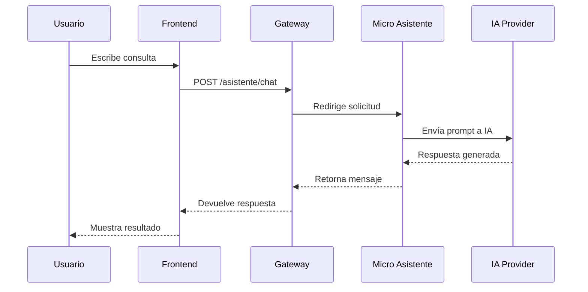

# Diagrama de Secuencia – Consulta al Asistente

```mermaid
sequenceDiagram
    participant U as Usuario
    participant FE as Frontend
    participant GW as Gateway
    participant AS as Micro Asistente
    participant IA as IA Provider

    U->>FE: Escribe consulta
    FE->>GW: POST /asistente/chat
    GW->>AS: Redirige solicitud
    AS->>IA: Envía prompt a IA
    IA-->>AS: Respuesta generada
    AS-->>GW: Retorna mensaje
    GW-->>FE: Devuelve respuesta
    FE-->>U: Muestra resultado
```
